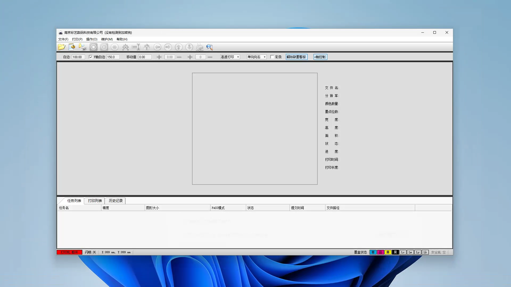
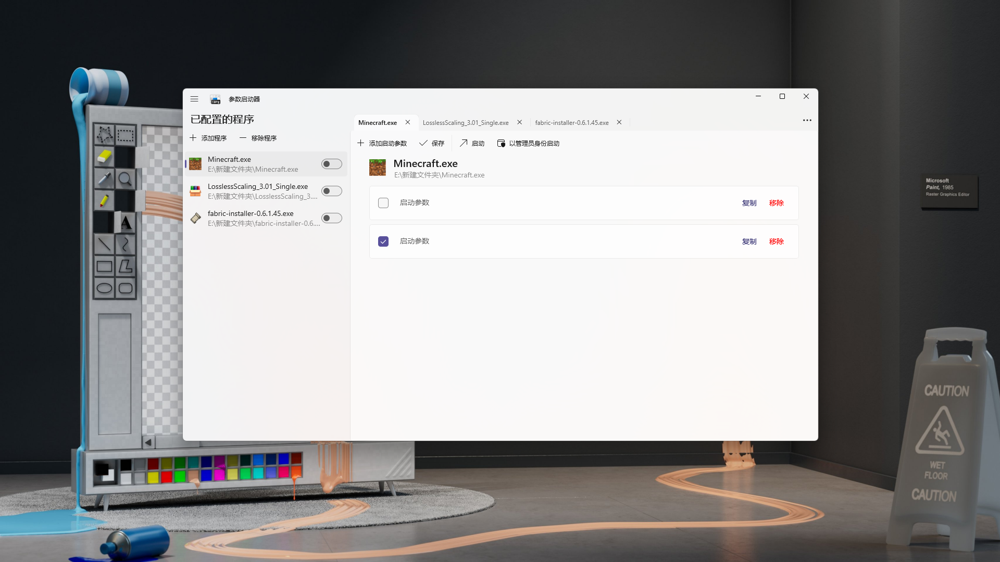
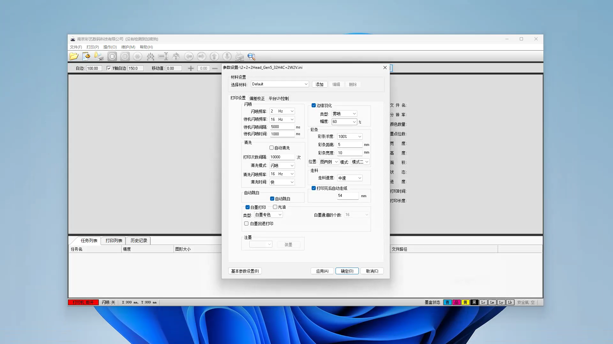
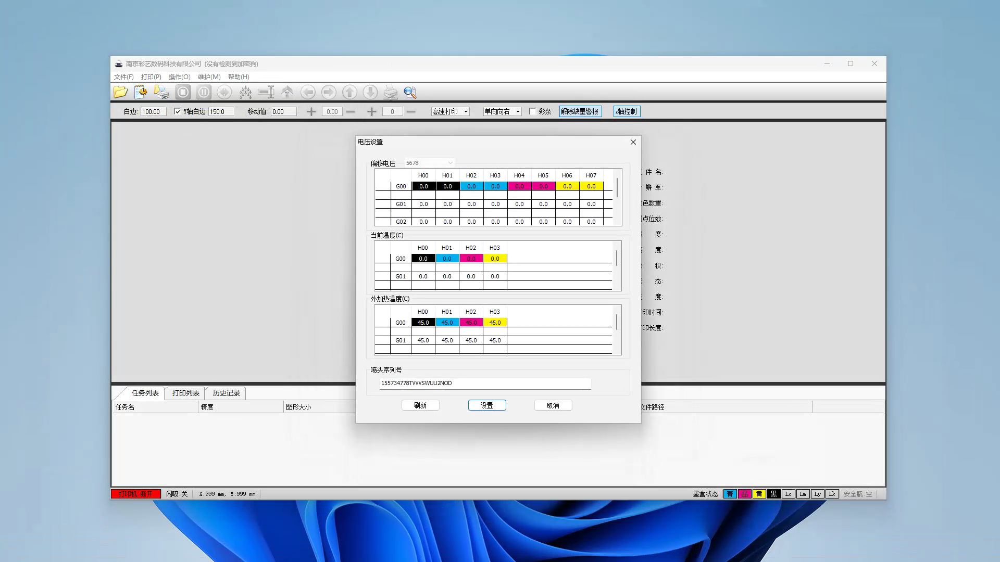

# Parameter-Launcher

**Parameter-Launcher** is a practical application that provides knowledge about the currency of English-speaking countries. Through content introduction and interactive experience, users will have a deeper cultural impression of English-speaking countries. It is aimed at all groups of students and teachers.

This is **the first official release**, and if you want to download the app, you can get the link in Releases and Packages on the right side of the page or just use the download link provided below.

https://github.com/yuconglin2023/YCL-Presentator/blob/main/YCL%20Presentator_setup.exe

**_App ScreenShots_**

