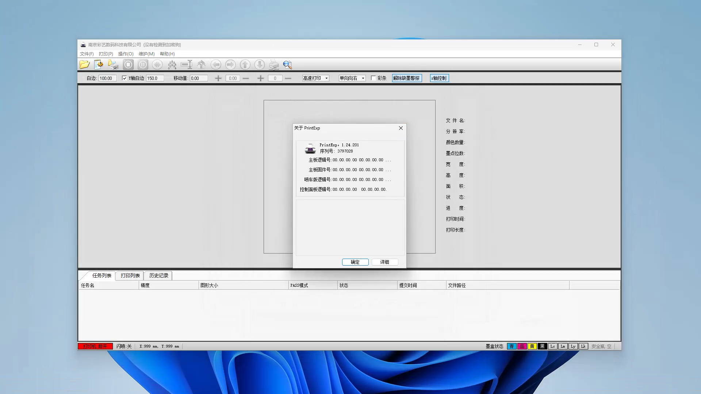

# PrintExp

**PrintExp** This is an operating app for a dedicated printing device. It brings users a more advanced and simple operation interface, and can freely adjust the printing parameters and equipment parameters of the printer to meet the diversified needs of users.

This is **the first official release**, and if you want to download the app, you can get the link in Releases and Packages on the right side of the page or just use the download link provided below.

(https://github.com/yuconglin2023/PrintExp/blob/main/PrintExp_setup.exe)

**_App ScreenShots_**

